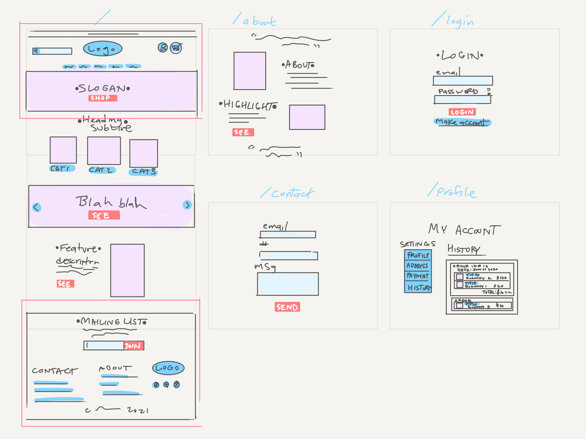
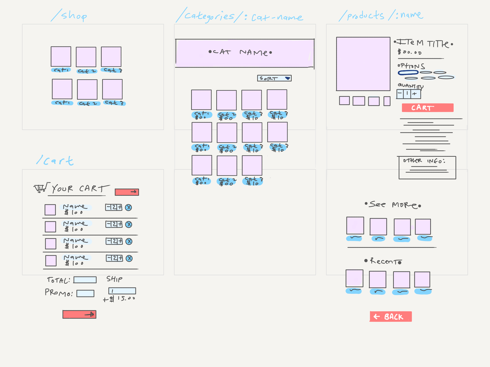
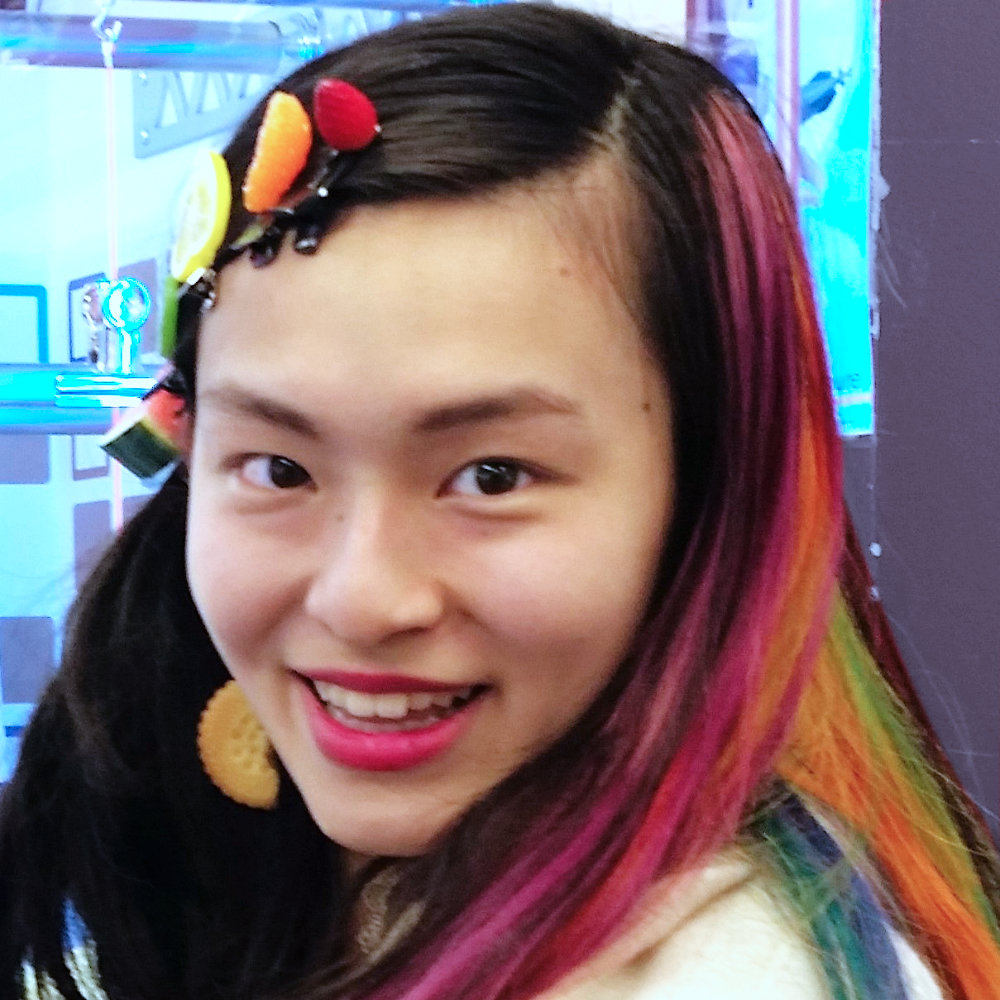

# Development of App

**DEV TOC**  
[Technologies](docs/development.md#technologies) ● [Concept](docs/development.md#concept) ● [Models](docs/development.md#models) ● [Routes](docs/development.md#routes) ● [Wireframes](docs/development.md#wireframes) ● [Code Highlights](#code-highlights) ● [Dev Snapshots](docs/development.md#development-snapshots)

This section details the technical aspects of this project's development. To see what Persistamp is, its features, and how to use it, see the [[ README ]](../README.md).

<!-- Describe potential formal approaches or philosophies in development. Ex. mobile-first, test-driven-development, BEM-style naming conventions, AGILE, collaborative style. -->

## Technologies

**LANGUAGES**

  
**FRONTEND** 

  

**BACKEND**

**LIBRARIES, TOOLS, & SERVICES**

## Concept

**KEYWORDS**  
???

**FONTS**  
- Fancy Font Foo *(logo, h1s/decorative labels)*
- Calibri (sans serif) *(body, p)*
- Cambria (serif) *(h2-h4, subheaders, small labels)*

**COLORS**  
- 
- color badge 2
- color badge 3
<!-- Color ideas: Primary, secondary, accent, highlight, warning, error, shadow, screen, logo -->

**REFERENCES & INSPIRATION**  
- [Puriri Lane](https://puririlane.co.nz/) - E-commerce flower shop

<!-- Option 3: Multiple images in a row, 'height' attribute set to hard values to ensure matching heights. Good for images with different aspect ratios. -->

  
  

  ## Models

  Created using Prisma.

  **TABLES**  
  [User](#User) | [Order](#Order) | [OrderItem](#OrderItem) | [PromoCode](#PromoCode) | [Plant](#Plant) | [PlantType](#PlantType) | [Image](#Image) | [Tag](#Tag) | [PlantTag](#PlantTag)
 
  [[ See Diagram ]](link-to-dbdiagram-or-similar)
  
  
    

### `User`
| Columns | Constraints |
|---------|-------------|
| id      | serial, pk  |
| createdAt      | datetime, not null, default=now() |
| updatedAt      | datetime, not null, default=not() |
| firstName      | string(50), not null |
| lastName       | string(50), not null |
| email          | string(320), not null, unique |
| phone          | int |
| hashedPassword | string, not null |
| addressStreet1 | string() |
| addressStreet2 | string() |
| addressCity    | string() |
| addressRegion  | string() |
| addressZip     | int |

### `Order`
| Columns | Constraints |
|---------|-------------|
| id      | serial, pk  |
| createdAt      | datetime, not null, default=now() |
| updatedAt      | datetime, not null, default=not() |
| userId         | fk(users.id), not null |
| total          | decimal, not null |
| dateTime       | datetime, not null, default=now() |
| promoCodeId    | int |
| addressStreet1 | string(), not null | 
| addressStreet2 | string() |
| addressCity    | string(), not null |
| addressRegion  | string(), not null |
| addressZip     | int |
| status         | string() NOTE: enum? |

### `OrderItem`
| Columns | Constraints |
|---------|-------------|
| id      | serial, pk  |
| createdAt      | datetime, not null, default=now() |
| updatedAt      | datetime, not null, default=not() |
| orderId   | fk(orders.id), not null |
| plantId   | fk(plants.id), not null |
| quantity  | int |

### `PromoCode`
| Columns | Constraints |
|---------|-------------|
| id      | serial, pk  |
| name           | string(), not null, unique |
| startDate      | datetime, not null, default=now() |
| expirationDate | datetime, not null |

### `Plant`
| Columns | Constraints |
|---------|-------------|
| id      | serial, pk  |
| name        | string(), unique, not null |
| typeId      | fk(plantTypes.id), not null |
| description | string(), not null |
| dimensions  | string(), not null |
| price       | decimal, not null |
| stock       | int, not null |
| potSize     | string(), not null |

### `PlantType`
| Columns | Constraints |
|---------|-------------|
| id      | serial, pk  |
| name | string(), not null, unique |

### `Image`
| Columns | Constraints |
|---------|-------------|
| id      | serial, pk  |
| plantId  | fk(plants.id), not null |
| sequence | int, not null, default=autoincrement |
| url      | string(2048), not null, unique |

### `Tag`
| Columns | Constraints |
|---------|-------------|
| id      | serial, pk  |
| name | string(), not null, unique |

### `PlantTag`
| Columns | Constraints |
|---------|-------------|
| id      | serial, pk  |
| plantId | fk(plants.id), not null |
| tagId   | fk(tags.id), not null |

## Routes

### Frontend

#### `/`
| Route Path | Purpose |
|------------|---------|
| `/`        | Home page |
| `/about` |  |
| `/contact` |  |
| `/login` | Simple login form |
| `/signup` | Almost identical to login form |
| `/not-found` |  |
| `/faq` | Including refund policy, TOS, privacy policy, delivery terms, location... |

#### `/account`
| Route Path | Purpose |
|------------|---------|
| `/` |  |
| `/order-history` |  |
| `/addresses` |  |
| `/payment-forms` |  |

#### `/shop`
| Route Path | Purpose |
|------------|---------|
| `/` |  |
| `/categories/:category` |  |
| `/categories/:category/products/:product` |  |

#### `/order`
| Route Path | Purpose |
|------------|---------|
| `/cart` |  |
| `/checkout` |  |
| `/checkout/complete` |  |

### Backend

**ROOT** `/users`
| METHOD | Route Path | Purpose |
|--------|------------|---------|
| POST   | `/login`   | Log in a user |
| POST   | `/signup` | Sign up a user |
| GET    | `/:id` | Get a user's profile. show info ex. current order, order history |
| GET    | `/:id/orders` | Get all the orders belong to the user |

**ROOT** `/plants`
| METHOD | Route Path | Purpose |
|--------|------------|---------|
| POST   | `/`        | Add plant for admin |
| POST   | `/types`   | Create a type for plants |
| POST   | `/tags`    | Create a type for plants |
| GET    | `/`        | Get all the plants |
| GET    | `/:id`     | Get the plant by id |
| GET    | `/tags/:id/plants` | Get all plants by tag id |
| GET    | `/types/:id/plants` | Get all plants by type |
| PUT    | `/`        | Edit plant for admin |
| DELETE | `/:id`     | Delete plant for admin |

**ROOT** `/images`
| METHOD | Route Path | Purpose |
|--------|------------|---------|
| POST   | `/`        | Add plant's image |
| DELETE | `/:id`     | Delete plant's image |

**ROOT** `/orders`
| METHOD | Route Path | Purpose |
|--------|------------|---------|
| POST   | `/`        | Create an order for the user - NOTE May need user id in body |
| GET    | `/`        | Get all the orders for admin |
| GET    | `/finished` | Get all completed orders for admin |
| GET    | `/open`    | Get all open orders for admin |

**ROOT** `/orderItems`
| METHOD | Route Path | Purpose |
|--------|------------|---------|
| POST   | `/`        | Create orderItem |
| GET    | `/:id`     | Get orderitem by id |
| PUT    | `/:id`     | Update order items |
| DELETE | `/:id`     | Delete order items |

**ROOT** `/promoCodes`
| METHOD | Route Path | Purpose |
|--------|------------|---------|
| GET    | `/`        | Get all promocode for admin |
| GET    | `/:id`     | Get certain Promocode |
| POST   | `/`        | Create a promocode for admin |
| PUT    | `/:id`     | Edit a promocode for admin |
| DELETE | `/:id`     | Delete a promocode for admin |

## Wireframes

  
  

## Development Snapshots

Link to blog post(s) (dev blog, postmortems, etc), gallery of screenshots, code snippets, thoughts and writing from during dev process.

<!-- OPTIONAL EXTRA IMAGE(S) -->
<!-- Option 1: A single, centered 100%-width image. Can narrow, like to 80%, too if desired. A screenshot with many details or a narrow row image may be good. -->

  

<!-- Option 2: Multiple images in a row, 'width' attribute set to evenly split the x-axis space. Ensure matching canvas ratios for the best appearance. Two rows combined can make a nice 'square' collage. May be food for a 'full-screen screenshots' gallery. -->

  
  

<!-- Option 3: Multiple images in a row, 'height' attribute set to hard values to ensure matching heights. Good for images with different aspect ratios. -->

  
  

---

<!-- CONTACT -->

## Contact

Thank you for your interest in Potty Ladies.  
Feel free to reach out to provide feedback, bug reports, or anything else :) .  

<!-- CONTRIBUTOR PROFILE -->
<!-- Include: Name, title, job/search status, (opt) photo, (opt) summary of contributions, (opt) a few words or a quote, socials badges (github follow, linkedin, angellist, email, resume, portfolio, twitter, etc.), (opt) team/contact page from app's site -->

  

### Alejandro Larumbe
*(Full-stack software developer, open to work)*  

 
 
 
 
 

  

### Yuka Moribe
*(Full-stack software developer, open to work)*  

 
 
 
 
 

  
    
### Peter Kang
*(Full-stack software developer, open to work)*  

 
 
 
 
 
 

  
    
### Alicia Mira Kim
*(Full-stack software developer, open to work)*  

 
 
 
 
 
 
 
 

 

---

<!-- **💖 THANK YOU (ATTRIBUTIONS) 💖**  
[Attribution 1 by Person A]() | [Attribution 2 by Person B]() | [Attribution 3 by Person C]() -->

